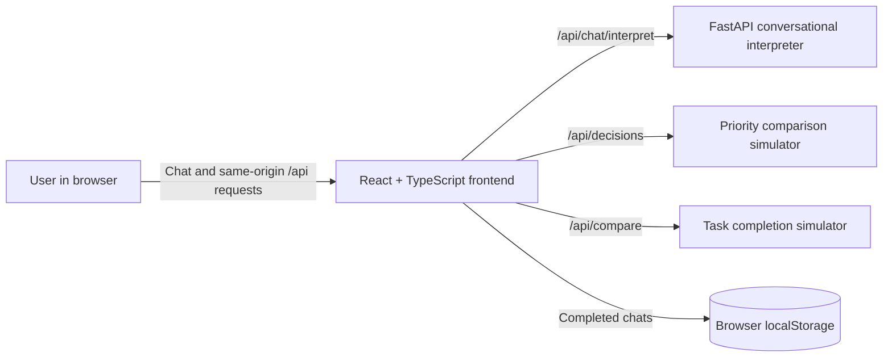

# DejaVu

**A conversational decision planner that helps you compare choices using what matters to you.**

DejaVu turns an open-ended decision into a clear view of the options, priorities, likely tradeoffs, and uncertainty. It asks follow-up questions in a chat, then presents a visual comparison so the user can make the call.

> This is a decision-support tool, not a source of objective predictions or a substitute for professional advice. Results reflect the priorities and estimates entered by the user.

## What it does

- Accepts everyday decision questions, such as choosing between class and a family event, or balancing exercise with coursework.
- Helps identify options and separate high-priority concerns from less important ones.
- Asks how each option may affect the user’s priorities and how confident they feel in those estimates.
- Runs a seeded Monte Carlo comparison and displays fit scores, uncertainty ranges, scenario cards, potential benefits, and tradeoffs.
- Saves completed chats in the current browser and can ask whether a priority that recurs across previous decisions matters again.
- Includes a decision trace showing the inputs and scoring method used.

The current conversation UI supports a broad range of decisions. The backend’s structured natural-language interpreter is narrower: it handles gym/fitness and work/assignment planning. General decisions use the frontend conversation flow and heuristic parsing.

## Product tour

1. **Describe the decision.** Include the options if you already know them.
2. **Name what matters.** Put the most important factor first; explain naturally.
3. **Estimate the effects.** Share a gut feeling about how each option affects each priority.
4. **Calibrate uncertainty.** Say how often similar expectations tend to be right.
5. **Explore the scenarios.** Compare the visual scores, ranges, benefits, and tradeoffs.

## Architecture



| Layer | Main files | Responsibility |
| --- | --- | --- |
| Frontend | `frontend/src/App.tsx`, `conversation.ts`, `api.ts` | Conversational flow, input interpretation, saved chat archive, and visual results. |
| Backend API | `backend/app/main.py`, `models.py` | FastAPI routes and Pydantic request/response validation. |
| Natural-language interpreter | `backend/app/nlu.py` | Rule-based extraction, confidence, clarification, and short-term planning state for supported study/fitness decisions. |
| Simulations | `backend/app/simulation.py` | Seeded Monte Carlo comparisons for user priorities or task completion estimates. |
| Styling | `frontend/src/index.css` | Dark interface, responsive layouts, charts, and scenario cards. |

### Decision scoring

For a general decision, each priority has a weight from 1–5 and each option receives an impact estimate from −2 to +2 for that priority. The weighted impact is mapped to a 0–100 fit score:

```text
weighted impact = sum(impact × priority weight) / sum(priority weights)
fit score       = clamp(50 + 25 × weighted impact, 0, 100)
```

Each simulation run adds Gaussian noise to the user’s estimates. The confidence answer controls the noise level. The results show the average fit and 10th–90th percentile range. Those numbers illustrate how the comparison changes under uncertainty; they are not objective probabilities of success.

### Conversation memory and privacy

- Completed chats and results are stored in browser `localStorage` under `dejavu.saved-chats.v1` (up to 30 chats).
- The app looks for a repeated top-ranked priority across at least two completed chats. It asks whether that priority applies to a new decision instead of silently applying it.
- The saved archive stays in that browser profile and is not sent to the backend. The backend receives only the current interpretation turn or comparison request.
- This is local context, not model training or fine-tuning. The underlying model is not trained on chat history.
- Use **Clear chats & memory** in the sidebar to remove the archive. Clearing browser site data also removes it.
- The gym/work interpreter carries its compact session snapshot in the browser between requests. This lets multi-turn interpretation work across stateless serverless requests.

## Tech stack

- **Frontend:** React 19, TypeScript, Vite
- **Backend:** Python, FastAPI, Pydantic
- **Simulation:** Python standard library (`random`)
- **Frontend checks:** TypeScript/Vite build and Node’s built-in test runner
- **Backend checks:** pytest

## Run locally

You need Python 3.10+ and Node.js/npm.

Clone the repository and enter its root directory:

```bash
git clone https://github.com/theakhinabraham/dejavu.git
cd dejavu
```

### 1. Start the API

```bash
cd backend
python3 -m venv .venv
source .venv/bin/activate
python -m pip install -r requirements.txt
uvicorn app.main:app --reload --port 8000
```

The API is available at `http://localhost:8000`. FastAPI’s interactive API reference is at `http://localhost:8000/docs`.

### 2. Start the frontend

In another terminal:

```bash
cd frontend
npm install
npm run dev
```

Open `http://localhost:5173`. Vite proxies `/api` requests to the local FastAPI server on port 8000.

### Build the frontend

```bash
cd frontend
npm run build
```

## API routes

| Method | Path | Purpose |
| --- | --- | --- |
| `GET` | `/api/health` | Health check. |
| `POST` | `/api/chat/interpret` | Extracts supported study/fitness planning details, tracks confidence and corrections, and asks clarifying questions. |
| `POST` | `/api/decisions` | Compares user-defined options against user-defined priorities. This is the route used by the current chat UI. |
| `POST` | `/api/compare` | Compares task completion scenarios using planned and required hours. |

Example general comparison payload:

```json
{
  "question": "Should I attend class or go to a family function?",
  "criteria": [
    { "name": "Attendance", "priority": 5 },
    { "name": "Family time", "priority": 2 }
  ],
  "options": [
    {
      "name": "Go to class",
      "impacts": [
        { "criterion": "Attendance", "impact": 2 },
        { "criterion": "Family time", "impact": -1 }
      ]
    },
    {
      "name": "Attend the function",
      "impacts": [
        { "criterion": "Attendance", "impact": -2 },
        { "criterion": "Family time", "impact": 2 }
      ]
    }
  ],
  "confidence": 4,
  "runs": 2000,
  "seed": 42
}
```

The API validates 1–5 criteria, 2–4 options, an estimate for every option/criterion pair, confidence from 1–5, and 500–10,000 simulation runs.

## Deploy to Vercel

The repository includes a root-level `vercel.json` configured as a Vercel Services project:

- `backend` is the FastAPI service at `backend/`, with entry point `app.main:app`.
- `frontend` is the Vite service at `frontend/`.
- `/api/*` is routed to the backend first; all other paths go to the frontend.
- Both services receive public requests through those routes. There are no service bindings because API requests originate in the user’s browser and use the shared public `/api` path.

To run the same route setup locally with Vercel CLI, install the CLI and run from the repository root:

```bash
npm install --global vercel
vercel dev -L
```

Vercel Services are currently documented as a beta feature. Review the [Vercel Services documentation](https://vercel.com/docs/services) before deploying, since platform requirements can change.

## Configuration and secrets

The `.env.example` files contain placeholders and future configuration names. The current chat and simulator do not require a Gemini API key: the active comparison path is rule-based plus deterministic Python simulation. Do not commit real API keys or place server secrets in frontend `VITE_` variables. Configure secrets in the hosting platform’s server environment if a future backend integration needs them.

## Tests and checks

Run from the repository root:

```bash
(cd backend && .venv/bin/pytest)
(cd frontend && node --test tests/*.test.mjs)
(cd frontend && npm run build)
```

The backend parser tests live in `backend/tests/`; frontend option-parsing tests live in `frontend/tests/`.

## Repository layout

```text
.
├── backend/
│   ├── app/
│   │   ├── main.py          # FastAPI routes
│   │   ├── models.py        # Request and response schemas
│   │   ├── nlu.py           # Conversational planning interpreter
│   │   └── simulation.py    # Monte Carlo comparison logic
│   ├── tests/               # Backend tests
│   └── requirements.txt
├── frontend/
│   ├── src/
│   │   ├── App.tsx          # Chat flow, archive, and results
│   │   ├── api.ts           # Typed API client
│   │   ├── conversation.ts  # Option extraction helpers
│   │   └── index.css        # Interface styles
│   └── tests/               # Frontend helper tests
├── documentation.docx       # Full project documentation
└── vercel.json              # Multi-service Vercel routing
```

## Project documentation

For detailed component descriptions, request/response fields, simulation assumptions, privacy boundaries, setup, limitations, and troubleshooting, see [`documentation.docx`](documentation.docx).
